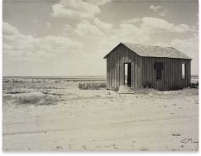

# Макет 4
 
1. `'Надпись DOROTHEA LANGE'`

   > - тип шрифта '**Montserrat**'
   > - размер шрифта `24px`

2. Надпись  "OCTOBER 15 - MARCH 18".
   > цвет `#FF473A`

3. Надпись "FLOOR 3":
   > - размер шрифта : **`10px`
   > - цвет: `#979797`

4. Расстояние от изображения до нижней части экрана составляет ***`183.92`***

5. Основное изображение 

